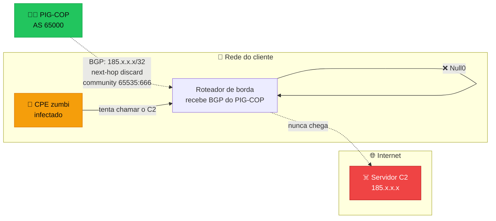
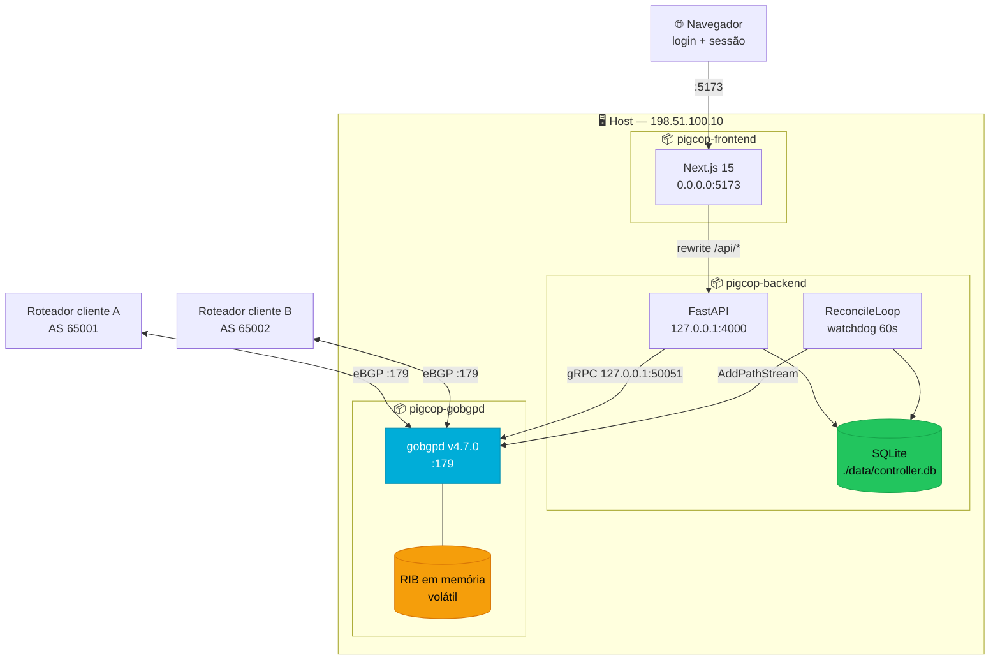
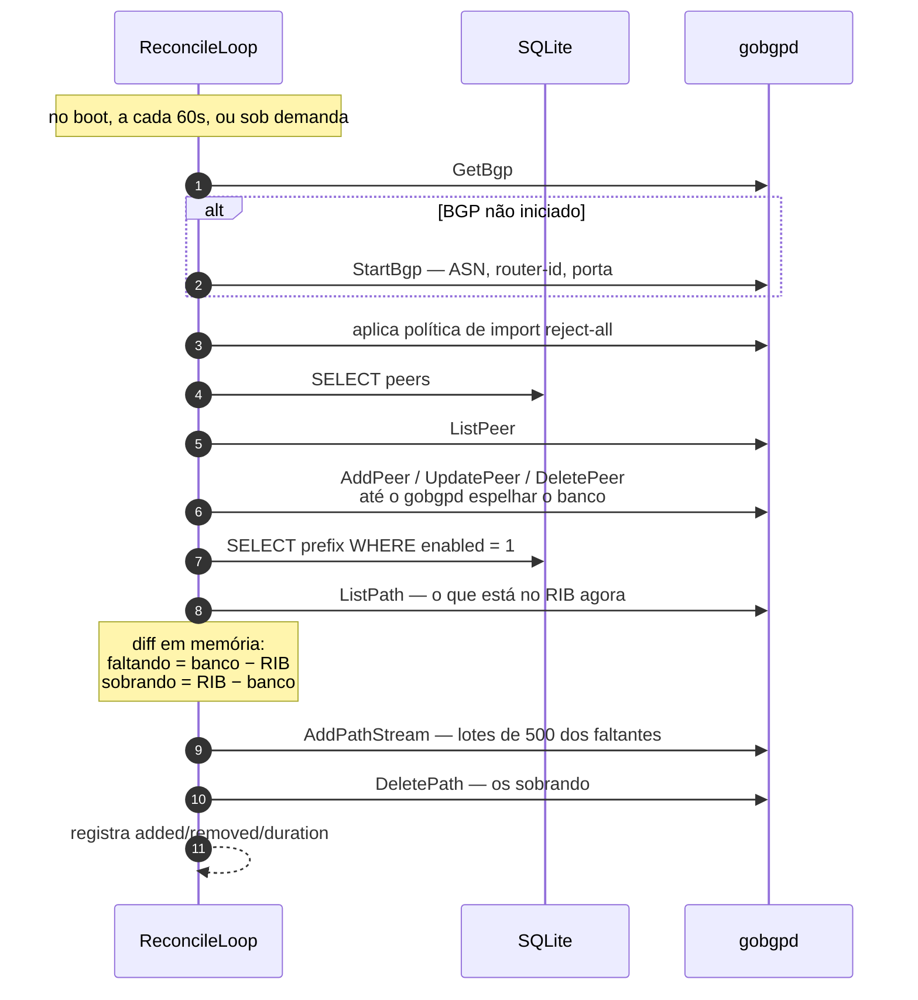
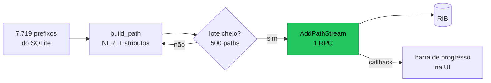
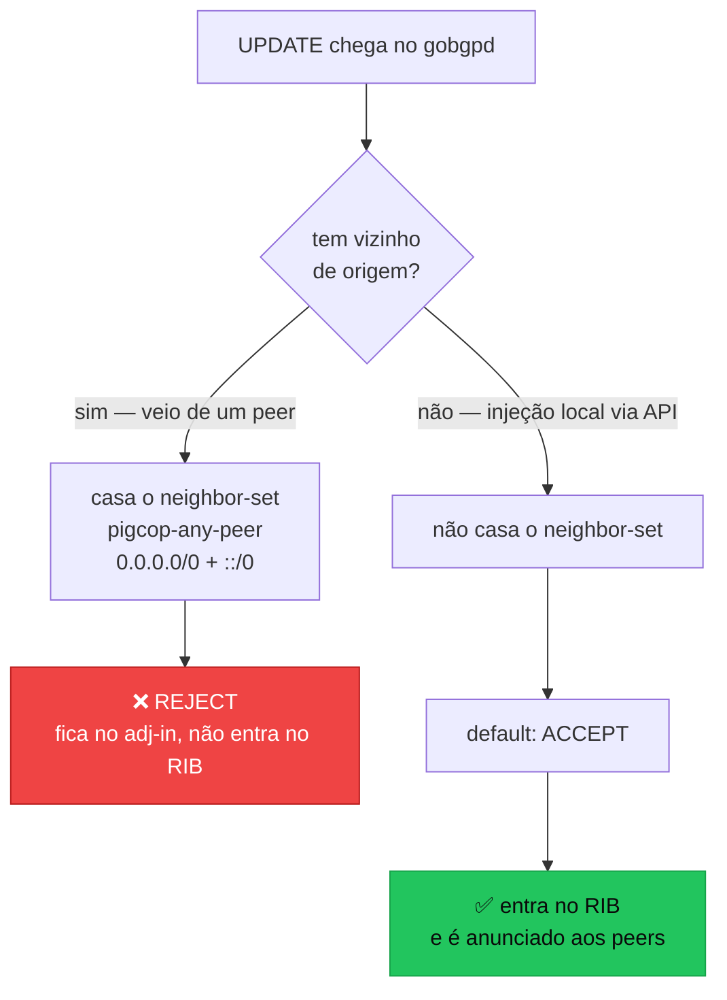
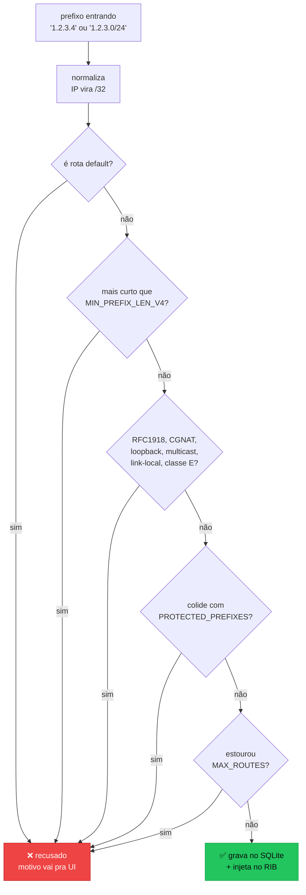
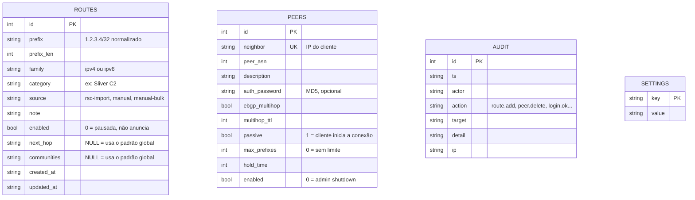
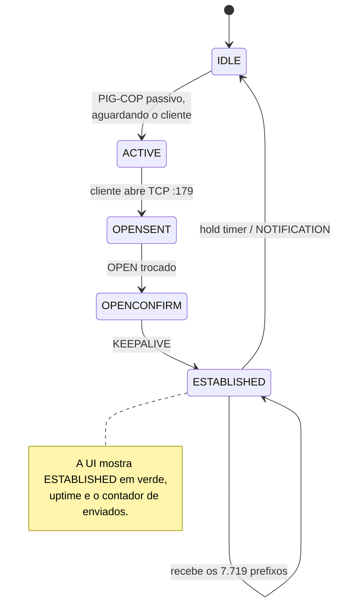
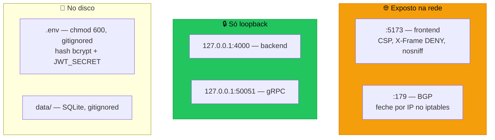

<div align="center">

# 🐷👮 PIG-COP

### *I've Got ~~Balls~~ Routers Of Steel*

**Controller GoBGP que mata DDoS na origem.**

Anuncia por BGP os prefixos dos **controladores C2 de botnets** — os endereços que
comandam CPEs zumbis para disparar ataques. O cliente aponta esses prefixos para
`discard`/`Null0`, o zumbi perde contato com o dono, e o ataque não sai.


</div>

---

## Instalação em uma linha

```bash
git clone https://github.com/andrediashexa/pig-cop.git /opt/pigcop
cd /opt/pigcop && sudo ./install.sh
```

O `install.sh` instala o Docker se faltar, pergunta o ASN e a senha, gera os
segredos **já com o escape correto**, builda, sobe e oferece importar o
`rotas.rsc`. É idempotente — rodar de novo não rotaciona nada.

Modo desatendido:

```bash
sudo ./install.sh -y --asn 264999 --password 'SenhaForte' \
     --protected 203.0.113.0/24,198.51.100.0/22 --import
```

<details>
<summary>Todas as opções do <code>install.sh</code></summary>

| Flag | O quê |
|---|---|
| `--user USUARIO` | usuário do login web (padrão `hexanetworks`) |
| `--password SENHA` | senha. Omitido: pergunta, ou gera aleatória em `-y` |
| `--asn NUMERO` | **ASN local — obrigatório** |
| `--router-id IP` | router-id BGP (padrão: IP principal do host, detectado) |
| `--next-hop IP` | next-hop de descarte (padrão `192.0.2.1`) |
| `--communities CSV` | communities padrão (padrão `65535:666`) |
| `--protected CSV` | prefixos que nunca podem ser anunciados |
| `--web-port PORTA` | porta da interface (padrão `5173`) |
| `--import` / `--no-import` | importa ou não o `rotas.rsc` no final |
| `-y`, `--non-interactive` | não pergunta nada |
| `--skip-docker` | não mexe no Docker |
| `--force-env` | regera o `.env` — **rotaciona os segredos** |

O que ele faz, em ordem: valida o ambiente → instala `curl`/`iproute2`/Docker →
checa se as portas 179, 5173, 4000 e 50051 estão livres (reconhece as do próprio
PIG-COP e reaproveita) → gera hash bcrypt cost 12 e `JWT_SECRET` de 32 bytes →
escreve o `.env` com `chmod 600` → builda → sobe → espera o `/api/health`
responder → importa a base → imprime as credenciais e as regras de firewall que
faltam.

</details>

---

## Índice

- [O que é isso](#o-que-é-isso)
- [Arquitetura](#arquitetura)
- [Instalação em uma linha](#instalação-em-uma-linha)
- [Instalação manual](#instalação-manual)
- [Como funciona](#como-funciona)
  - [O RIB é volátil — e por que isso importa](#o-rib-é-volátil--e-por-que-isso-importa)
  - [Injeção em massa](#injeção-em-massa)
  - [Política de import: reject-all](#política-de-import-reject-all)
  - [Guard-rails de prefixo](#guard-rails-de-prefixo)
- [Modelo de dados](#modelo-de-dados)
- [Configurando um cliente](#configurando-um-cliente)
- [As telas](#as-telas)
- [API](#api)
- [Operação e troubleshooting](#operação-e-troubleshooting)
- [Segurança](#segurança)
- [Referência do `.env`](#referência-do-env)
- [Estrutura do projeto](#estrutura-do-projeto)
- [Decisões de projeto](#decisões-de-projeto)

---

## O que é isso

Um provedor que quer proteger seus clientes de botnets tem duas opções: filtrar
tráfego (caro, precisa de appliance no caminho) ou **não deixar o bot falar com o
C2** (de graça, usa o BGP que já existe).

O PIG-COP faz a segunda. Ele é um **speaker BGP que só fala** — nunca escuta. O
cliente fecha uma sessão eBGP, recebe alguns milhares de `/32` com next-hop de
descarte e community `BLACKHOLE`, e instala tudo no `Null0`. Quando um CPE
infectado tenta chamar o servidor de comando, o pacote morre na borda do cliente.



O dataset inicial (`rotas.rsc`) tem **7.719 IPs únicos** em **40 categorias** —
Kimwolf, Metasploit C2, Sliver C2, Cobalt Strike, Mythic, Havoc, XMRig e cia.

---

## Arquitetura

Três containers, todos em `network_mode: host`. O SQLite é a fonte da verdade; o
RIB do GoBGP é só um reflexo dele.



| Container | O quê | Escuta em |
|---|---|---|
| `pigcop-gobgpd` | GoBGP v4.7.0 compilado do source, versão pinada | `:179` (BGP), `127.0.0.1:50051` (gRPC) |
| `pigcop-backend` | FastAPI + SQLite + cliente gRPC | `127.0.0.1:4000` |
| `pigcop-frontend` | Next.js 15, padrão Hexanium | `0.0.0.0:5173` |

> [!IMPORTANT]
> **Por que `network_mode: host` em tudo?**
> O BGP precisa enxergar o **IP real** do peer — com rede bridge o `docker-proxy`
> mascara a origem e a sessão não casa com o `neighbor-address` configurado.
> E colocando o backend também em host, ele alcança o gRPC em `127.0.0.1:50051`
> sem essa porta existir em rede nenhuma. Só o frontend escuta externamente.

---

## Instalação manual

> Se você usou o `install.sh` acima, pule esta seção — ela existe para quem
> quer entender ou controlar cada passo.

### Pré-requisitos

- Docker 24+ e Docker Compose v2
- Porta `179/tcp` livre no host (nenhum outro daemon BGP rodando)
- Acesso à internet no build (compila o GoBGP e baixa as deps)

### 1. Clone

```bash
git clone https://github.com/andrediashexa/pig-cop.git /opt/pigcop
cd /opt/pigcop
```

### 2. Gere os segredos

```bash
cp .env.example .env
./scripts/gen-secrets.sh 'a-senha-que-voce-quer'
```

A saída é algo assim:

```
ADMIN_PASSWORD_HASH=$2b$12$EXEMPLOEXEMPLOEXEMPLOexemploexemploexemploexemploexe
JWT_SECRET=0000exemplo0000exemplo0000exemplo0000exemplo0000exemplo0000exem
```

> [!WARNING]
> **Escape cada `$` do hash como `$$` ao colar no `.env`.**
> O Docker Compose interpola `$VAR` dentro do `.env` — sem escapar, o hash bcrypt
> chega truncado no container e o login falha sem erro claro.
> `$2b$12$abc...` vira `$$2b$$12$$abc...`

```bash
nano .env          # cole o hash escapado + o JWT_SECRET
chmod 600 .env
```

### 3. Ajuste o BGP

Ainda no `.env` — **isto não é opcional**, os valores de fábrica são placeholder:

```ini
LOCAL_ASN=65000                    # ← o ASN real da sua rede
ROUTER_ID=198.51.100.10            # ← IP do host
DEFAULT_NEXT_HOP=192.0.2.1         # next-hop de descarte
DEFAULT_COMMUNITIES=65535:666      # BLACKHOLE (RFC 7999)
PROTECTED_PREFIXES=203.0.113.0/24,198.51.100.0/24   # ← seus blocos e dos clientes
```

> [!CAUTION]
> **Preencha o `PROTECTED_PREFIXES`.** É a única coisa que impede alguém de
> blackholar sua própria rede — ou a de um cliente — por um dedo errado.
> Coloque ali todos os blocos que você anuncia.

### 4. Suba

```bash
docker compose up -d --build
```

O primeiro build compila o GoBGP (~2 min) e o Next.js (~1 min). Depois:

```bash
docker compose ps
```

```
NAME              STATUS
pigcop-backend    Up 2 minutes
pigcop-frontend   Up 2 minutes
pigcop-gobgpd     Up 2 minutes (healthy)
```

### 5. Acesse

```
http://SEU-IP:5173
```

Usuário: o `ADMIN_USER` do `.env` (padrão `hexanetworks`). Senha: a que você
passou pro `gen-secrets.sh`.

### 6. Importe a base de prefixos

Vá em **Importar** → escolha o `rotas.rsc` → deixe o filtro em `BLOCK-BGP` →
**Analisar (dry-run)**. Confira o relatório, e só então **Confirmar importação**.

Ou pela API:

```bash
curl -c /tmp/c.jar -X POST localhost:5173/api/auth/login \
  -H 'content-type: application/json' \
  -d '{"username":"hexanetworks","password":"SUA-SENHA"}'

curl -b /tmp/c.jar -X POST localhost:5173/api/routes/import \
  -F 'file=@rotas.rsc' -F 'only_list=BLOCK-BGP'
```

### 7. Feche o firewall

O gRPC e o backend já estão em loopback. Falta o BGP e a web:

```bash
# BGP só dos peers conhecidos
iptables -A INPUT -p tcp --dport 179 -s 200.100.50.1 -j ACCEPT
iptables -A INPUT -p tcp --dport 179 -j DROP

# interface web só da rede de gerência
iptables -A INPUT -p tcp --dport 5173 -s 10.95.200.0/24 -j ACCEPT
iptables -A INPUT -p tcp --dport 5173 -j DROP
```

Para TLS, ponha atrás do Traefik/nginx e mude `COOKIE_SECURE=true` no `.env`.

---

## Como funciona

### O RIB é volátil — e por que isso importa

O RIB do `gobgpd` vive **em memória**. Reinicie o container e os 7.719 anúncios
desaparecem — as sessões voltam, mas vazias. Um controller que dependesse só do
RIB perderia a proteção toda num `docker restart`.

Por isso o **SQLite é a fonte da verdade** e existe um reconciliador:



Na prática: matei o `gobgpd`, o RIB zerou, e em menos de um segundo depois do
watchdog acordar os 7.719 prefixos estavam de volta — junto com os peers.

O dashboard mostra **Prefixos anunciados** (banco) e **Prefixos no RIB** (gobgpd)
lado a lado. Divergência entre os dois é visível na hora.

### Injeção em massa

Injetar 7.719 prefixos com `gobgp global rib add` num laço são 7.719 processos —
2 a 3 minutos. Via `AddPathStream` em lotes de 500, é **~0,3 segundo**:



Cada path carrega `ORIGIN=IGP`, o next-hop de descarte e as communities. Em IPv6
o next-hop vai dentro do `MP_REACH_NLRI` (não pode usar o atributo `NEXT_HOP`).

### Política de import: reject-all

O PIG-COP **só anuncia**. Nada que o peer mandar entra no nosso RIB — nem por
acidente, nem por cliente mal configurado, nem por cliente malicioso.



> [!NOTE]
> **Duas armadilhas que custaram tempo aqui — leia antes de mexer nessa parte.**
>
> **1. Política por peer não funciona.** O GoBGP só aceita `apply_policy` por
> vizinho em *route-server client*. Em peer normal ele responde
> `non-rs-client peer X doesn't have per peer policy`. Tem que ser política global.
>
> **2. `default_action = REJECT` no global quebra a injeção local.** As rotas que
> o próprio controller adiciona pela API passam pelo **mesmo pipeline de import** e
> são descartadas junto. O sintoma é traiçoeiro: o reconcile reporta
> *"7.719 injetadas"* com sucesso e o RIB continua vazio.
>
> A regra correta é explícita — casar o vizinho e rejeitar, deixando o default em
> accept para o que é local.

Conferir a qualquer momento:

```bash
docker exec pigcop-gobgpd gobgp --host 127.0.0.1 global policy import
docker exec pigcop-gobgpd gobgp --host 127.0.0.1 policy neighbor
```

```
Import policy:
Default: ROUTE_ACTION_ACCEPT
Name pigcop-reject-from-peers:
    StatementName pigcop-reject-from-peers-stmt:
      Conditions:
        NeighborSet: any pigcop-any-peer
      Actions:
         reject
```

O dashboard acende um badge **vermelho** se essa política sair do ar. E o
reconcile a reaplica a cada volta — não dá pra ficar desconfigurada por acidente.

<details>
<summary><b>Validação com peer BGP real</b> — clique para expandir</summary>

Um `gobgpd` de teste (AS 65002) fechou sessão com o controller, recebeu os 7.719
prefixos, e tentou anunciar `9.9.9.0/24` e `0.0.0.0/0` de volta:

```
# no PIG-COP: o que chegou no fio
$ gobgp neighbor 172.17.0.2 adj-in
   ID  Network        Next Hop      AS_PATH   Age       Attrs
   0   0.0.0.0/0      172.17.0.2    65002     00:00:06  [{Origin: ?}]
   0   9.9.9.0/24     172.17.0.2    65002     00:00:06  [{Origin: ?}]

# entrou no RIB?
$ gobgp global rib 9.9.9.0/24 -a ipv4
Network not in table
$ gobgp global rib 0.0.0.0/0 -a ipv4
Network not in table

# total continua intacto
$ gobgp global rib -a ipv4 | tail -n +2 | wc -l
7719
```

As duas ficaram no `adj-in` e nenhuma entrou. O peer, do lado dele, recebeu os
7.719 normalmente.

</details>

### Guard-rails de prefixo

O risco real de um controller RTBH não é técnico — é **blackholar rede legítima**.
Toda rota passa por `backend/app/validators.py` antes de tocar o banco ou o RIB:



A checagem do `PROTECTED_PREFIXES` é bidirecional: recusa tanto uma rota **dentro**
de um bloco protegido quanto uma rota que **contém** um bloco protegido.

O import em massa roda o mesmo validador linha a linha, e o dry-run mostra cada
recusa com o número da linha e o motivo — nada entra silenciosamente.

---

## Modelo de dados



`UNIQUE(prefix, family)` garante que não dá pra cadastrar o mesmo prefixo duas
vezes. `enabled = 0` mantém a rota no banco mas fora do RIB — útil pra pausar uma
categoria sem perder o histórico.

---

## Configurando um cliente

### No PIG-COP

**Sessões BGP** → **Novo peer**:

| Campo | O quê |
|---|---|
| IP do vizinho | IP de onde o cliente vai conectar |
| ASN do cliente | ASN dele |
| Senha MD5 | opcional, recomendado |
| Modo passivo | **deixe ligado** — o cliente inicia a conexão |
| eBGP multihop | ligue se o peer não é diretamente conectado |
| Limite de prefixos | 0 (não recebemos rotas de qualquer forma) |

O peer é criado no `gobgpd` na hora, com a política de import reject-all já
aplicada.

### No lado do cliente

O ciclo da sessão:



O PIG-COP já anuncia com o next-hop de descarte, então o `set ip next-hop` nos
exemplos abaixo é reforço — garante o comportamento mesmo se o cliente quiser um
endereço de descarte diferente do nosso.

**Cisco IOS:**

```
router bgp 65001
 neighbor 198.51.100.10 remote-as 65000
 neighbor 198.51.100.10 password SENHA
 neighbor 198.51.100.10 description PIG-COP
 address-family ipv4
  neighbor 198.51.100.10 activate
  neighbor 198.51.100.10 route-map PIGCOP-IN in
  neighbor 198.51.100.10 maximum-prefix 50000
 !
ip route 192.0.2.1 255.255.255.255 Null0
!
route-map PIGCOP-IN permit 10
 set ip next-hop 192.0.2.1
```

**MikroTik RouterOS 7:**

```
/routing bgp connection
add name=pigcop remote.address=198.51.100.10 remote.as=65000 \
    local.role=ebgp input.filter=pigcop-in

/ip route
add dst-address=192.0.2.1/32 blackhole

/routing filter rule
add chain=pigcop-in rule="accept"
```

**Juniper:**

```
protocols bgp group pigcop {
    type external;
    peer-as 65000;
    neighbor 198.51.100.10;
    import pigcop-in;
}
policy-statement pigcop-in {
    then { next-hop 192.0.2.1; accept; }
}
routing-options static route 192.0.2.1/32 discard;
```

> [!TIP]
> O cliente pode filtrar por community em vez de aceitar tudo — cada categoria
> pode ganhar sua própria community (`SEU-ASN:100` para C2, `SEU-ASN:200` para
> scanners, etc) editando `communities` na rota. Aí ele escolhe o que quer bloquear.

---

## As telas

Interface no padrão **Hexanium** (`guia-de-interface-interno`) — dark por padrão,
tokens HSL, sidebar 248/64px.

| Tela | O que faz |
|---|---|
| **Visão geral** | KPIs de sessões, prefixos no banco vs. no RIB, última sincronização, política de anúncio com o badge do reject-all, top 12 categorias em barras |
| **Sessões BGP** | Peers com estado colorido, uptime, contadores de recebidos/enviados. Soft reset, shutdown, habilitar, CRUD. Drawer de detalhe com capabilities, timers, flaps e último NOTIFICATION. Auto-refresh de 10s |
| **Rotas anunciadas** | Busca com debounce, filtro por categoria e estado, paginação server-side de 100. Seleção múltipla → remover em lote. Add individual ou colando uma lista. Export CSV/TXT/RSC |
| **Importar** | Dry-run obrigatório: total lido, novos, já existentes, inválidos linha a linha com motivo, categorias detectadas, address-lists encontradas. Só depois a importação, com barra de progresso |
| **Auditoria** | Quem fez o quê, quando, de qual IP — inclusive tentativas de login falhas |

---

## API

Tudo sob `/api`, autenticado por cookie JWT httpOnly. `login` e `health` são as
únicas exceções.

<details>
<summary><b>Endpoints</b> — clique para expandir</summary>

### Auth
| | |
|---|---|
| `POST /api/auth/login` | `{username, password}` → set-cookie. Rate-limit 5/min/IP |
| `POST /api/auth/logout` | limpa o cookie |
| `GET /api/auth/me` | usuário da sessão + versão |

### Sistema
| | |
|---|---|
| `GET /api/health` | liveness, sem auth. Inclui o estado do gRPC |
| `GET /api/stats` | KPIs, política ativa, estado do reconcile |
| `POST /api/reconcile` | força ressincronização → devolve `job_id` |
| `GET /api/jobs/{id}` | progresso de import/reconcile |
| `GET /api/rib` | amostra do RIB real, decodificada (diagnóstico) |
| `GET /api/audit` | histórico paginado |

### Peers
| | |
|---|---|
| `GET /api/peers` | config do banco **mesclada** com o estado ao vivo do gRPC |
| `POST /api/peers` | cria e aplica no gobgpd na hora |
| `PATCH /api/peers/{id}` · `DELETE /api/peers/{id}` | |
| `POST /api/peers/{id}/softreset?direction=out` | reenvia as rotas |
| `POST /api/peers/{id}/reset` | hard reset |
| `POST /api/peers/{id}/enable` · `/disable` | admin up/down |

### Rotas
| | |
|---|---|
| `GET /api/routes` | `?q=&category=&enabled=&family=&page=&page_size=&sort=&order=` |
| `GET /api/routes/categories` | categorias com contagem |
| `POST /api/routes` | uma rota — valida, grava, injeta |
| `POST /api/routes/bulk` | várias colando texto |
| `POST /api/routes/bulk-delete` | `{ids: [...]}` |
| `POST /api/routes/{id}/toggle` | pausa/retoma sem apagar |
| `DELETE /api/routes/{id}` | |
| `POST /api/routes/preview` | **dry-run** do import, não grava nada |
| `POST /api/routes/import` | importa de verdade → `job_id` |
| `GET /api/routes/export?format=csv\|txt\|rsc` | |

</details>

Exemplo — adicionar um C2 novo:

```bash
curl -b /tmp/c.jar -X POST localhost:5173/api/routes \
  -H 'content-type: application/json' \
  -d '{"prefix":"45.128.10.7","category":"Mirai C2","note":"ticket #4412"}'
```

```bash
$ docker exec pigcop-gobgpd gobgp --host 127.0.0.1 global rib 45.128.10.7/32 -a ipv4
*> 45.128.10.7/32   192.0.2.1   [{Origin: i} {Communities: blackhole}]
```

---

## Operação e troubleshooting

```bash
# estado geral
docker compose ps
docker compose logs -f backend

# o que está REALMENTE no RIB
docker exec pigcop-gobgpd gobgp --host 127.0.0.1 global rib -a ipv4 | head
docker exec pigcop-gobgpd gobgp --host 127.0.0.1 global rib -a ipv4 | tail -n +2 | wc -l

# sessões
docker exec pigcop-gobgpd gobgp --host 127.0.0.1 neighbor
docker exec pigcop-gobgpd gobgp --host 127.0.0.1 neighbor 200.100.50.1
docker exec pigcop-gobgpd gobgp --host 127.0.0.1 neighbor 200.100.50.1 adj-out   # o que mandamos
docker exec pigcop-gobgpd gobgp --host 127.0.0.1 neighbor 200.100.50.1 adj-in    # o que ele mandou (e foi rejeitado)

# testes do parser e dos guard-rails
docker compose run --rm --no-deps -T backend \
  sh -c "pip install -q pytest && python -m pytest app/tests -q"

# backup — o banco é o que importa, o RIB se reconstrói sozinho
docker exec pigcop-backend python -c \
  "import sqlite3;sqlite3.connect('/data/controller.db').backup(sqlite3.connect('/data/backup.db'))"
cp data/backup.db /lugar/seguro/
```

### Sintomas comuns

| Sintoma | Causa provável | O que fazer |
|---|---|---|
| Login sempre falha, sem erro no log | `$` do hash bcrypt não escapado como `$$` no `.env` | reescreva o `.env`, `docker compose up -d backend` |
| Sessão não sai de `ACTIVE` | firewall na 179, IP do peer errado, ou senha MD5 divergente | `adj-in` vazio + `docker compose logs gobgpd` |
| `Received > 0` e `Accepted = 0` | **é o comportamento correto** — o reject-all funcionando | nada |
| Dashboard: banco 7.719, RIB 0 | gobgpd reiniciou e o watchdog ainda não acordou | **Sincronizar RIB** ou espere 60s |
| Badge vermelho no import reject-all | política caiu do gobgpd | **Sincronizar RIB** reaplica |
| Import recusa tudo | `PROTECTED_PREFIXES` largo demais, ou `MIN_PREFIX_LEN_V4` restritivo | o dry-run mostra o motivo linha a linha |
| Peer aparece como "órfão" | existe no gobgpd mas não no banco | o próximo reconcile remove |

---

## Segurança



- Senha em **bcrypt cost 12**; o texto claro não existe em lugar nenhum do repo.
- JWT HS256 em cookie **httpOnly + SameSite=Strict**, TTL 8h — sem token em
  `localStorage`, então XSS não rouba sessão.
- Rate-limit de 5 tentativas/min por IP, com registro em auditoria. Erro de login
  é genérico: não revela se o usuário existe.
- OpenAPI/Swagger **desabilitados** (`docs_url=None`) — a superfície da API não
  fica documentada pra quem não devia ver.
- CSP com `connect-src 'self'`, sem CDN externo.
- Import reject-all: cliente nenhum consegue injetar rota no controller.
- Toda mutação (rota, peer, login) vai pra tabela `audit` com ator, IP e timestamp.

---

## Referência do `.env`

| Variável | Padrão | O quê |
|---|---|---|
| `ADMIN_USER` | `hexanetworks` | usuário do login |
| `ADMIN_PASSWORD_HASH` | — | bcrypt do `gen-secrets.sh`. **Escape `$` → `$$`** |
| `JWT_SECRET` | — | 32 bytes aleatórios do `gen-secrets.sh` |
| `COOKIE_SECURE` | `false` | `true` quando estiver atrás de TLS |
| `LOCAL_ASN` | `65000` | **ASN do controller — ajuste** |
| `ROUTER_ID` | `198.51.100.10` | **router-id BGP — ajuste** |
| `BGP_LISTEN_PORT` | `179` | |
| `GOBGP_VERSION` | `v4.7.0` | tag compilada no build |
| `GRPC_LISTEN` | `127.0.0.1:50051` | não mude pra `0.0.0.0` sem firewall |
| `DEFAULT_NEXT_HOP` | `192.0.2.1` | next-hop anunciado |
| `DEFAULT_COMMUNITIES` | `65535:666` | BLACKHOLE (RFC 7999) |
| `PROTECTED_PREFIXES` | *(vazio)* | **CSV dos blocos que nunca podem ser anunciados** |
| `MAX_ROUTES` | `50000` | teto global |
| `MIN_PREFIX_LEN_V4` | `24` | recusa prefixo mais curto |
| `RECONCILE_INTERVAL` | `60` | segundos entre reconciliações |
| `WEB_PORT` | `5173` | porta da interface |
| `APP_VERSION` | `0.1.0` | congelada no `next build` — rebuilde pra trocar |

---

## Estrutura do projeto

```
pig-cop/
├── docker-compose.yml           # 3 serviços, todos network_mode: host
├── .env.example                 # copie para .env
├── rotas.rsc                    # dataset semente: 7.719 IPs de C2
├── scripts/gen-secrets.sh       # gera hash bcrypt + JWT_SECRET
│
├── gobgpd/Dockerfile            # compila GoBGP na tag pinada
│
├── backend/
│   ├── Dockerfile               # gera os stubs gRPC no build
│   ├── protos/api/*.proto       # protos vendorizados (mesma tag do gobgpd)
│   └── app/
│       ├── main.py              # FastAPI + lifespan que sobe o watchdog
│       ├── config.py            # settings via env
│       ├── db.py                # SQLite WAL + schema + audit()
│       ├── auth.py              # bcrypt, JWT, rate-limit
│       ├── validators.py        # ← os guard-rails de prefixo
│       ├── importer.py          # ← parser do .rsc
│       ├── jobs.py              # jobs em background com progresso
│       ├── gobgp/
│       │   ├── client.py        # ← wrapper gRPC + política reject-all
│       │   ├── encode.py        # modelo ⇄ protobuf
│       │   └── reconcile.py     # ← diff SQLite × RIB
│       ├── routers/             # auth, peers, routes, system
│       └── tests/               # pytest: parser + validadores
│
└── frontend/                    # Next.js 15, padrão Hexanium
    ├── app/{layout,page}.jsx
    └── src/
        ├── App.jsx              # auth, tema, nav por estado
        ├── layout/AppShell.jsx  # sidebar, mobile, tema
        ├── components/          # ui/*, Toast, PageHeader, Slogan
        ├── features/            # login, dashboard, peers, routes, import, audit
        └── lib/                 # api.js, format.js, utils.js
```

Os arquivos que valem ler primeiro estão marcados com `←`.

---

## Decisões de projeto

<details>
<summary><b>Por que GoBGP v4 e não v3</b></summary>

A API v4 usa `oneof` tipado para NLRI e atributos, em vez de
`google.protobuf.Any`. Montar um path fica direto, sem empacotamento manual — e
o mesmo vale pra decodificar o RIB de volta. Os protos são vendorizados em
`backend/protos/api/` na mesma tag do daemon, e os stubs Python são gerados no
`docker build` (nada de stub versionado envelhecendo no repo).

</details>

<details>
<summary><b>Por que o gobgpd sobe sem arquivo de config</b></summary>

O `gobgpd` roda sem `-f`: fica esperando `StartBgp` pela API. Global, peers e
políticas vêm todos do backend por gRPC. Isso elimina um TOML paralelo que
poderia divergir do banco — o SQLite é a única fonte da verdade, e o reconcile
garante que o daemon reflita ele.

</details>

<details>
<summary><b>Por que SQLite e não Postgres</b></summary>

7.7k linhas com índice em `prefix`, `category` e `enabled`. Modo WAL, consulta
paginada de 100. Zero operação, backup é copiar um arquivo. Se a base crescer
uma ordem de magnitude ou aparecer mais de um controller, a troca é localizada
em `db.py`.

</details>

<details>
<summary><b>Por que paginação server-side e não virtualização</b></summary>

O plano original previa `@tanstack/react-virtual` para renderizar 7.7k linhas.
Mas com paginação de 100 no servidor o cliente nunca recebe mais que isso —
menos JS, menos dependência, e a busca fica no SQLite (que indexa) em vez de
filtrar array no browser.

</details>

<details>
<summary><b>Por que o reconcile também remove</b></summary>

O diff é nos dois sentidos: injeta o que falta e **remove o que sobra**. Como o
import reject-all garante que o RIB global só tem rota nossa, qualquer prefixo no
RIB que não esteja no banco é resíduo — de um delete que falhou no meio, ou de
uma injeção manual por fora. O reconcile limpa.

</details>

---

<div align="center">

**PIG-COP** · Hexa Networks

*I've Got ~~Balls~~ Routers Of Steel*

</div>
